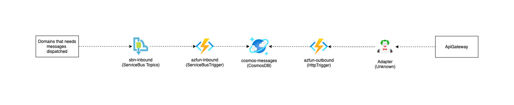
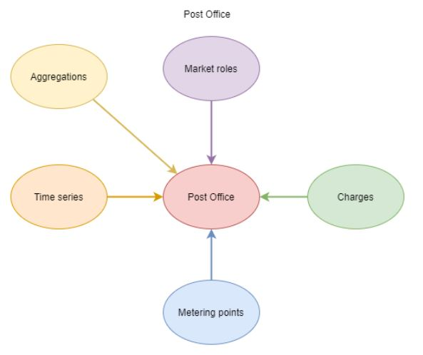

# Post Office

- [Intro](#intro)
- [Delivering documents to the post office](#delivering-documents-to-the-post-office)
- [Peek and dequeue documents from the post office](#peek-and-dequeue-documents-from-the-post-office)
- [Architecture](#architecture)

## Intro

The Post Office is the central place for handling outbound documents from within the Green Energy Hub.

This means that any domain inside the Green Energy Hub that has a document which outside actors needs to be able to peek, will have to deliver the document to the Post Office using the appropriate type.

See [Delivering documents to the post office](#delivering-documents-to-the-post-office).

Any document delivered to the Post Office will then be processed, saved in a storage and thus made available for outside market actors to peek and eventually dequeue.

The Market Actors will only be able to peek and dequeue documents that they are marked as recipients of. See [Fetching documents from the post office](#peek-and-dequeue-documents-from-the-post-office).

### Architecture



## Context Streams



## Domain Road Map

No work planned in current program increment.

## Delivering documents to the post office

To deliver a document to the Post Office from a domain, the domain will have to insert a document into the corresponding topic of the `sbn-inbound-postoffice` service bus.

The service bus contains 3 Topics.

- aggregations
- marketdata
- timeseries

All documents inserted into each of the topics will then be processed and placed in a collection of documents corresponding to the topic.
This means that when a domain places a document in the `timeseries` topic, this document will only be peekable using the `timeseries` type on the outbound end of the Post Office.

### Format

All documents inserted into the topics will have to comply with the protobuf contract exposed [here](source/Contracts/v1/Document.proto).

If a document is inserted into the queue that does not comply with this contract, **IT WILL NOT** be handled.

## Peek and dequeue documents from the post office

### Authenticating

TODO: This will have to be updated once we know more about how authentication is done throughout the system.

### GET:/Peek

It is possible in the Post Office to peek a given number of documents.

Once a peek has been made, the system will check if a bundle of documents already exists, if that is the case then those will be returned.

If no bundle exists, the system will select the number of documents requested, generate a new bundle id and return the documents.

This means if a repetetive number of peek's is made, the same bundle of documents will always be returned.
It is necessary to dequeue a bundle, before being able to get a new bundle of messages.

```https
GET https://{{YOUR_DOMAIN_URL}}/api/Peek
```

#### Peek URI Parameters

| Name | Required |  Type | Description |
| --- | --- | --- | --- |
| `recipient` | True | string | The id of the recipient to peek documents on |
| `group` | True | string | The group of documents to peek, current groups is `marketdata`, `timeseries` and `aggregations` |
| `pageSize` | False | integer | The number of documents to peek, defaults to 1. |

#### Peek Responses

| Name | Type | Description |
| --- | --- | --- |
| 200 OK | [Peeked documents](#peeked-documents) | OK |
| 204 No Content | [NoContentResult](https://docs.microsoft.com/en-us/dotnet/api/microsoft.aspnetcore.mvc.nocontentresult?view=aspnetcore-5.0) | If no documents is available for peeking. |
| 400 Bad Request | [BadRequestErrorMessageResult](https://docs.microsoft.com/en-us/dotnet/api/system.web.http.badrequesterrormessageresult?view=aspnetcore-2.2) | If `recipient` is missing, the following error will be outputted: _'Query parameter is missing 'recipient'_. |
| 400 Bad Request | [BadRequestErrorMessageResult](https://docs.microsoft.com/en-us/dotnet/api/system.web.http.badrequesterrormessageresult?view=aspnetcore-2.2) | If `type` is missing, the following error will be outputted: _'Query parameter is missing 'type'_. |
| 500 Server error | [ArgumentNullException](https://docs.microsoft.com/en-us/dotnet/api/system.argumentnullexception?view=net-5.0) ||

### POST:/Dequeue

This method is used to dequeue a bundle of documents.

```https
POST https://{{YOUR_DOMAIN_URL}}/api/Dequeue
```

#### Dequeue Request body

| Name | Required |  Type | Description |
| --- | --- | --- | --- |
| `bundle` | True | string | The id of the bundle to dequeue |
| `recipient` | True | string | The id of the recipient to dequeue documents on |

#### Dequeue Responses

| Name | Type | Description |
| --- | --- | --- |
| 200 OK | [OkResult](https://docs.microsoft.com/en-us/dotnet/api/microsoft.aspnetcore.mvc.okresult?view=aspnetcore-5.0) | OK |
| 400 Bad Request | [BadRequestErrorMessageResult](https://docs.microsoft.com/en-us/dotnet/api/system.web.http.badrequesterrormessageresult?view=aspnetcore-2.2) | If `bundle` is missing, the following error will be outputted: _Request body is missing 'bundle'_. |
| 400 Bad Request | [BadRequestErrorMessageResult](https://docs.microsoft.com/en-us/dotnet/api/system.web.http.badrequesterrormessageresult?view=aspnetcore-2.2) | If `recipient` is missing, the following error will be outputted: _Request body is missing 'recipient'_. |
| 404 Not Found | [NotFoundResult](https://docs.microsoft.com/en-us/dotnet/api/microsoft.aspnetcore.mvc.notfoundresult?view=aspnetcore-5.0) |
| 500 Server error | [ArgumentNullException](https://docs.microsoft.com/en-us/dotnet/api/system.argumentnullexception?view=net-5.0) ||

## Types

### Peeked documents

An array of documents.

```json
[
   {
      "Recipient": "string",
      "Type": "string",
      "EffectuationDate": "Date",
      "Content": "Dynamic",
      "Bundle": "string"
   }
]
```
